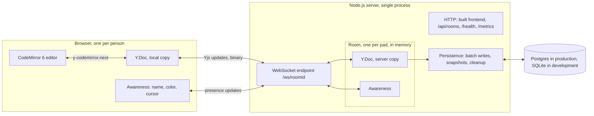
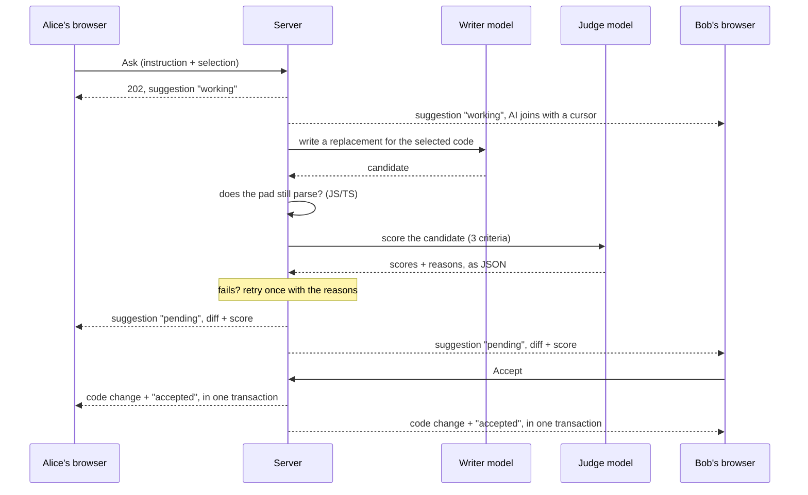

# PairPad

A real-time collaborative code scratchpad. Create a pad, share the link, and two to ten people can type in the same document at once, with no sign-up.

- **Live editing** with syntax highlighting for JavaScript, TypeScript, Python and plain text. The language choice is shared by everyone in the pad.
- **Presence**: each person has a name and color, a live cursor and selection, and appears in a "who's here" list.
- **Works through disconnects**: you keep typing while offline and your edits merge when you reconnect.
- **Persistent**: pads survive server restarts and are deleted after 7 days without use.
- **AI pair programmer**: "PairPad AI" joins the pad when asked, proposes a change as an inline diff for everyone, and checks its own work before showing it. A person always decides whether to apply it. Runs on free-tier APIs only.

Built with React, TypeScript and Vite on the client; Node.js, TypeScript and `ws` on the server; [Yjs](https://yjs.dev) for conflict-free merging; CodeMirror 6 for the editor.

## Architecture



What happens when you type a character:

1. CodeMirror applies it to your local `Y.Doc` straight away, so typing never waits for the network.
2. The `y-websocket` provider sends the resulting Yjs update to the server over a WebSocket.
3. The server checks the update (well-formed, within the size limit), applies it to the room's `Y.Doc`, and relays it to everyone else in the room.
4. Each other browser applies the update to its own `Y.Doc`, and CodeMirror shows the change.
5. The server collects updates for 300 ms and writes them to the database as one row.

Presence (names, colors, cursors) travels the same WebSocket using Yjs awareness. It is never stored: it disappears when a person disconnects.

One Node process serves everything on one port: the built frontend, the HTTP API and the WebSocket endpoint.

## Why a CRDT instead of last-write-wins

With last-write-wins, each save replaces the document (or a region of it) with the newest version. If two people type at the same moment, whichever write arrives second wins and the other person's characters vanish. For a tool whose whole purpose is typing at the same time, that is the common case, not an edge case.

A CRDT (conflict-free replicated data type) avoids the conflict instead of picking a winner:

- Every character gets a permanent unique ID, and each edit is recorded relative to the characters around it ("insert `x` after character 41 from client A") rather than at a line and column.
- Because edits are described that way, they can be applied in any order, and more than once, and every copy still ends up identical.
- Nothing is overwritten. If you and I both type at position 0, both insertions are kept, in an order every copy agrees on.

That one property gives several things for free:

| Need | How the CRDT covers it |
| --- | --- |
| Simultaneous typing | Both edits are kept; nobody's characters are lost. |
| Offline editing | Edits made offline are ordinary edits that arrive late, and merge the same way. |
| Server restart | The stored document is a list of updates that can be replayed in any order. |
| Server crash | A browser that still has the pad open sends the server whatever it is missing. |

The costs are real but small here: a Yjs document carries some bookkeeping beyond the text, and deleted characters leave small markers behind. That is why the size limit below is measured on the stored document, not the visible text.

## AI collaborator

<!-- Demo: add a recording of two windows and the AI at docs/ai-demo.gif, then replace this comment with:

-->

Anyone in a pad can open the **Ask AI** panel, optionally select some code, and type an instruction such as "add input validation to this function". PairPad AI then joins the pad like a person: it appears in the who's-here list with its own color and an "AI" badge, and its cursor sits on the code it is working on.

Its answer is never written straight into the code. It arrives for everyone at once as a **suggestion**: an inline diff (removed lines struck through in red, added lines in green) with a bar above it, and a card in the panel with the instruction, a quality score, one reason per check, and **Accept** and **Reject**. Anyone in the pad can decide, and everyone sees the outcome immediately.

### The flow



1. **Asking.** The browser sends the instruction and the selection (as Yjs relative positions, so they still point at the right code if someone types meanwhile). A selection inside a single line is widened to the statement it belongs to, so selecting a function's name means the whole function. With no selection, the AI works on the whole pad.
2. **Joining.** The server joins the pad as its own awareness client, with its own client ID, name, color and cursor. It is not a socket, so it never takes one of the 10 places.
3. **Writing.** The server sends the selected code, the surrounding code and the instruction to the writer model, and asks for the replacement text as JSON.
4. **Checking.** See "Verify, then show" below.
5. **Sharing.** The suggestion lives in a `suggestions` map inside the pad's Yjs document, so every client sees it, and every status change, in real time: working (with what the AI is doing), pending, accepted, rejected, stale or failed.
6. **Deciding.** Accept and Reject go to the server, which applies an accepted change and its new status in **one Yjs transaction**, so nobody ever sees one without the other.

### Verify, then show

A model's first answer is often almost right. In a shared pad, showing a broken or overreaching suggestion to several people costs everyone's attention, and accepting one by mistake breaks the code for everyone. So nothing is shown until it has passed two checks, and nothing is applied until a person accepts it.

1. **Syntax check** (JavaScript and TypeScript). The TypeScript compiler checks that the whole pad still parses with the change applied. Scratch code is often unfinished, so the rule is relative: the change may not add syntax errors. Code that fails here is never sent to the judge.
2. **LLM-as-judge.** A second, smaller and faster model scores the change from 0 to 1 on three criteria, with one short reason for each:
   - **Does what was asked**: carries out the instruction fully and correctly.
   - **Minimal and in scope**: changes only what the instruction needs, with no reformatting, renaming or extras.
   - **Safe**: no risky behaviour (deleting data, leaking secrets, injection, disabling checks, unrequested network or file access) and no obvious new bugs.

   The judge must answer with strict JSON. The server validates it (each score must be a number from 0 to 1, each reason non-empty) and treats anything else as a failed check rather than trusting it.
3. **Pass rule.** The average must be at least **0.70**, and no single criterion may be below **0.50**. The floor stops a clearly unsafe change from passing on the strength of the other two.
4. **One retry.** If either check fails, the writer gets one more attempt and is told exactly why the first was turned down: the parse error (with the text on either side of its replacement), or the judge's low scores and reasons.
5. **Still not good enough?** The card says "AI couldn't produce a confident suggestion" and lists the reasons and scores. No diff is shown and the code is untouched.

The final score and the three reasons appear on the card and in the bar above the diff, along with whether the code still parses and whether it passed on the second try.

### Exactly once, and owned by the server

- **Accept is applied exactly once.** Decisions are HTTP requests handled by the server, which processes them one at a time. Of several people clicking Accept together, the first applies the change and the rest are told it was already accepted.
- **Clients cannot fake a suggestion.** The `suggestions` map is shared state, but only the server writes it: if a client edits it directly (to change the proposed code, the score or the status), the server immediately overwrites it with its own copy.
- **Stale detection.** The server watches the pad: when someone edits the code under a pending suggestion, it is marked **out of date** for everyone and can no longer be accepted. Undoing the edit makes it pending again. Out-of-date and failed suggestions offer **Re-run**, which asks again with the same instruction on the code as it is now.

### Free setup

The AI runs only on free tiers that need no credit card, through one OpenAI-compatible client whose base URL, key and model names come from environment variables. The server keeps every key; browsers never see one. **Without a key**, the app works as normal and the AI panel says the AI isn't set up.

1. Create a free Groq API key at [console.groq.com/keys](https://console.groq.com/keys).
2. Optionally, create a GitHub fine-grained personal access token with the **Models: read** account permission at [github.com/settings/personal-access-tokens](https://github.com/settings/personal-access-tokens/new). It is used when Groq is rate limited.
3. Copy `.env.example` to `.env` and paste in the key (and token), or set them as environment variables on your host.
4. Restart the server. The startup log shows the providers and models in use, for example `AI: Groq (openai/gpt-oss-120b, judged by openai/gpt-oss-20b), falling back to GitHub Models (...)`.

| Provider | Role | Default models (write / judge) | Free allowance | Key |
| --- | --- | --- | --- | --- |
| [Groq](https://console.groq.com) | Primary | `openai/gpt-oss-120b` / `openai/gpt-oss-20b` | 30 requests/min, 1,000/day, 8K tokens/min per model | `GROQ_API_KEY` |
| [GitHub Models](https://github.com/marketplace/models) | Fallback | `openai/gpt-4.1` / `openai/gpt-4.1-mini` | Depends on your GitHub plan; about 50 to 150 requests/day on the free plan | `GITHUB_TOKEN` |
| [OpenRouter](https://openrouter.ai) | Optional | free `:free` models only | 20 requests/min, 50/day without credits | `OPENROUTER_API_KEY` |
| Any OpenAI-compatible API | Optional | your choice | | `CUSTOM_*` |

Free catalogs change often. Check the models in your provider's dashboard and override them with `<PROVIDER>_MODEL` and `<PROVIDER>_JUDGE_MODEL` (see `.env.example`). Cerebras is supported too (`AI_PROVIDER=cerebras`), but since 2026 its free credits require a payment method on file, so it is not a default. For tests and demos without any key, `AI_PROVIDER=mock` gives canned suggestions (add `[bad syntax]` or `[low score]` to an instruction to see the retry and the failure path).

**How the free allowance is protected:**

- **Caps**: each pad may make 10 AI requests per hour and the whole server 100 per day (`AI_ROOM_HOURLY_LIMIT`, `AI_DAILY_LIMIT`). The panel shows what is left. A request makes at most four model calls (write and judge, twice), so 100 requests stay well inside Groq's 1,000 calls per day per model. The counts are kept in memory and reset when the server restarts.
- **Fallback**: on a rate-limit or quota error (or an outage, a timeout or a rejected key), the call is tried once on the fallback provider. If that fails too, the person sees "AI is busy, try again in a minute" and nothing crashes.
- **Size**: at most 8,000 characters of selected code per request, with up to 12,000 characters of surrounding code for context. Larger pads are trimmed around the selection, and the model is told where lines were left out.
- **One at a time** per pad, and each request is stopped after 60 seconds (`AI_TIMEOUT_MS`) with a clear message.

### Design trade-offs

- **The server applies suggestions, not the browsers.** It is the only way to guarantee Accept happens exactly once. A CRDT merges concurrent edits instead of rejecting one, so two browsers each applying the same change would insert it twice. The cost: Accept needs a connection, and Ctrl+Z doesn't undo an accepted change, because your editor didn't make it.
- **Suggestions in the shared document, not a separate channel.** Everyone gets the same live state through the sync that already exists, it survives reconnects and restarts, and it is persisted with the pad. The cost is that suggestions add to the pad's size, so only the 30 most recent decided ones are kept.
- **A cheaper judge, and only one retry.** The judge needs to score a small diff, not write code, so a smaller model is fast and saves quota. One retry catches most near-misses; more would multiply the cost of a hopeless request.
- **An LLM judging an LLM is not proof of correctness.** The judge catches off-task, overreaching and obviously risky changes, and the syntax check catches broken code, but neither runs the code. That is why a person always decides.
- **Free tiers decide the limits.** The size limits and caps are set by the free allowances (Groq's 8,000 tokens per minute in particular), and the default models may change as providers update their free catalogs.
- **Partial-line selections are widened.** Rewriting a word inside a line almost never matches what people mean, so a selection inside one line becomes its enclosing statement. This was found with the first real model: selecting a function's name and asking for validation produced a whole function in place of the name.

## Running locally

Requires Node.js 22.5 or newer.

```bash
npm install
npm run dev
```

Open http://localhost:5173. To try collaboration, open the same pad in a second window; use a private window so the two do not share a saved name.

To run it the way it is deployed, as a single server serving the built frontend:

```bash
npm run build
npm start        # http://localhost:3001
```

In development, pads are saved to `server/data/pairpad.sqlite`. Delete that file to start fresh.

## Tests

```bash
npm test             # server unit and integration tests (Vitest)
npm run test:e2e     # browser tests (Playwright; builds the app first)
npm run typecheck
```

The first `test:e2e` run needs a browser: `npx playwright install chromium`.

**Server tests** (`server/test`, 191 tests) start a real server on a random port and connect simulated clients over real WebSockets:

- Room creation, and rejection of invalid room IDs.
- Sync: relaying edits, late joiners, room isolation, and two clients editing concurrently and converging on the same text with no lost characters.
- Persistence: reload after a restart, snapshots, retry after a failed write, recovery from a client's copy after a crash, and the 7-day cleanup.
- Limits: 10 users per room, the 1 MB document limit, oversized and malformed messages.
- AI collaborator, with the model replaced by a scripted test double: the verification gate (a passing suggestion, one that fails and passes on the retry, one that is rejected twice, an unsafe one, an invalid judge answer), Accept applied exactly once under five simultaneous clicks, Reject leaving the document unchanged, stale detection and Re-run, tampering with shared state, the caps, the timeout, and fallback between providers through the real OpenAI SDK against a fake provider.
- Storage: one set of tests runs against every backend. Postgres is covered by [PGlite](https://pglite.dev) (the Postgres engine compiled to WebAssembly), both called directly and through the production `pg` driver over a socket. Set `TEST_DATABASE_URL` to also run them against a Postgres server of your own.

**Browser tests** (`e2e`, 30 tests) drive two or more real Chromium windows against the production build: typing in both directions and at the same time, the language picker, presence and cursors, reconnecting and offline behaviour, the limit screens, and the AI flow with the mock provider (the AI joining, suggestions and diffs for both windows, Accept, Reject, two people accepting at once, the checks' scores, the retry, the failure card, and out-of-date suggestions with Re-run).

### Load test

```bash
npm run loadtest                                  # starts its own throwaway server
npm run loadtest -- --url https://your-server     # or test a running one
npm run loadtest -- --help
```

By default it opens 50 simulated clients across 5 rooms, has each one type 2 characters per second for 15 seconds, and measures how long every edit takes to reach every other client in its room. It exits with an error if any edit was not delivered, any client was dropped, or a room's clients ended up with different text.

A run on a laptop, client and server on the same machine (so no network delay is included):

```
Clients            50 across 5 rooms
Duration           15.0 s
Edits sent         1499 (100 per second)
Deliveries         13491 of 13491
Disconnects        0
Rooms converged    yes

Latency, from an edit to another client applying it:
  min   0.4 ms
  mean  2.7 ms
  p50   2.5 ms
  p95   4.8 ms
  p99   6.7 ms
  max   9.3 ms

Server /metrics    1099.3 messages/s over the last 10 s, 16959 in total
```

The server's message count is higher than the edit rate because it counts every incoming frame: each keystroke sends a document update and a cursor update, and the stock `y-websocket` client also echoes presence updates it receives back to the server, which ignores them.

## Configuration

All settings are environment variables, and all are optional for local development.

| Variable | Default | Meaning |
| --- | --- | --- |
| `PORT` | `3001` | Port the server listens on. |
| `HOST` | `0.0.0.0` | Address the server binds to. |
| `DATABASE_URL` | not set | Postgres connection string. When set, Postgres is used. |
| `SQLITE_PATH` | `server/data/pairpad.sqlite` | SQLite file, used when `DATABASE_URL` is not set. `:memory:` for a throwaway database. |
| `GROQ_API_KEY`, `GITHUB_TOKEN`, ... | not set | AI provider keys and settings. See "AI collaborator" and `.env.example`. |
| `REQUIRE_POSTGRES` | not set | Set to `1` to refuse to start without `DATABASE_URL`. Automatic on Replit deployments. |
| `STATIC_DIR` | `client/dist` | Built frontend to serve. |
| `MAX_USERS_PER_ROOM` | `10` | People allowed in one pad at a time. |
| `MAX_DOC_BYTES` | `1048576` | Largest stored document, in bytes. |

## Limits and endpoints

- **10 people per pad.** The 11th sees a "pad is full" page and can try again.
- **1 MB per document**, measured as the encoded Yjs document (text plus CRDT bookkeeping), because that is what is stored and sent to each person who joins. The editor stops accepting new text at 900 kB to leave room for the bookkeeping. Deleting is always allowed.
- **Malformed messages** close that connection; nobody else in the room is affected.
- **Inactive pads** are deleted after 7 days. Opening a pad counts as activity.

| Endpoint | Purpose |
| --- | --- |
| `POST /api/rooms` | Returns a new random room ID. |
| `GET /health` | `{ status, rooms, clients, messagesPerSecond }` |
| `GET /metrics` | The same counts plus total messages, uptime and the configured limits. |
| `WS /ws/<roomId>` | Yjs sync and awareness, using the `y-websocket` protocol. |
| `GET /api/rooms/<roomId>/ai` | Whether the AI is available, and the requests left. |
| `POST /api/rooms/<roomId>/ai` | Ask the AI. Returns 202 and the new suggestion's ID; the result arrives in the shared document. |
| `POST /api/rooms/<roomId>/suggestions/<id>/accept` | Apply a suggestion (exactly once). |
| `POST /api/rooms/<roomId>/suggestions/<id>/reject` | Discard a suggestion. |
| `POST /api/rooms/<roomId>/suggestions/<id>/rerun` | Ask again for an out-of-date or failed suggestion. |

"Rooms" are rooms currently in memory; "messages per second" is an average over the last 10 seconds.

## Persistence

A pad is stored as a list of Yjs updates in two tables (`rooms`, `room_updates`), behind a small interface (`server/src/storage/types.ts`) with three implementations: Postgres, SQLite and in-memory.

- Edits are collected for 300 ms and written as one merged update.
- After 100 rows, or when the last person leaves, the rows are replaced by a single snapshot.
- On `SIGTERM` or `SIGINT`, every pad in memory is saved before the process exits.
- A pad is unloaded from memory 30 seconds after the last person leaves and reloaded when someone opens it again.
- A failed write is kept and retried.

## Project layout

```
client/              React + Vite frontend
  src/pages/         Landing, Pad, NotFound
  src/components/    Editor, TopBar, PresenceMenu, StatusBadge, AiPanel
  src/lib/           Yjs session, presence, connection status, remote cursors,
                     suggestion diffs
server/
  src/server.ts      HTTP + WebSocket server, limits, metrics
  src/room.ts        One Y.Doc per room; sync and awareness; room lifecycle
  src/persistence.ts Batching, snapshots, retries
  src/storage/       Postgres, SQLite and in-memory backends
  src/ai/            AI collaborator: providers and fallback, presence,
                     suggestions, the verification gate (syntax + judge), caps
  test/              Vitest unit and integration tests
  loadtest/          Load test script
e2e/                 Playwright browser tests
```

## Deployment

The app is one long-running Node process and needs:

- A host that keeps a process running and supports WebSockets.
- **Exactly one instance.** Rooms live in the server's memory, so two instances would each hold their own copy of a pad.
- A Postgres database, supplied as `DATABASE_URL`. The tables are created on first start.

Build with `npm ci --include=dev && npm run build` and start with `npm start`.

### Deploying on Replit

The repository includes a `.replit` file with the build and run commands and the deployment type.

1. In Replit, choose **Import code or design**, then **GitHub**, and select this repository.
2. Add the database: open the **Database** tool in the workspace and create a PostgreSQL database. This provides `DATABASE_URL`.
3. Press **Run** once to check it starts. The console should print `Storage: Postgres`.
4. Open **Deployments** (or **Publish**), choose **Reserved VM**, keep the build and run commands from `.replit`, and deploy. Do not choose Autoscale: it can start several instances and stop them when idle.
5. Open the deployment's logs and confirm they also say `Storage: Postgres`.

A deployment without `DATABASE_URL` refuses to start instead of saving pads to a local file, because a deployment's disk may not survive a restart.

Then check the live app:

```bash
curl https://<your-app>.replit.app/health
npm run loadtest -- --url https://<your-app>.replit.app
```

The server listens on port 3001 unless `PORT` is set; `.replit` maps that port to the public one.

## Known limitations

- **No access control.** Anyone with a pad's link can read and edit it, by design.
- **Offline edits live in the open tab.** They are not saved to the browser's storage, so reloading or closing the tab while offline loses them. The browser warns before you do.
- **One server instance.** Scaling out would need a shared pub/sub layer between instances.
- **The AI's judge is a model too.** Its scores are a useful filter, not a guarantee; nothing runs the suggested code. A person decides every change.
- **A hard crash can lose up to 300 ms of edits** on the server, unless a browser that still has the pad open reconnects, in which case it sends them again.
